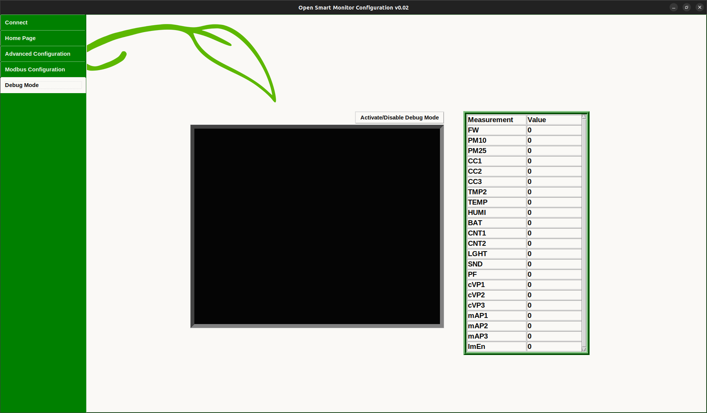

= OpenSmartMonitor Configuration GUI Operating Manual
:revdate: October 11, 2022
:revnumber: 1.0 
:revremark: {doctitle} 
:version-label!: 1.0
Marcus Holder

== Update Firmware

image::Images/connect_p.png[]
* Press update firmware.
* Select complete.bin which is the default image we provide for the sensor.
* Once you press open, you will be asked for confirmation on whether to write the image to the sensor.
* It will take a few seconds to download.

=== Connect
* Opening the GUI will bring you to the connect page.
* Select the correct USB port that your sensor is connected to and press connect, the application will then start communicating to the sensor and retrieving its configuration and populating the gui.
* You will then be transferred to the home page which displays current measurements and LoRaWAN configuration.

== Current Measurements

image::Images/home_p.png[]

This window reads all of the measurements currently on your OSM Device and allows you to set the amount of intervals that are bypassed by each measurement. This can be done by changing the number in the Uplink heading or if you prefer, you can change the amount of minutes per interval under Interval in Mins. You can also set the amount of samples that are taken within each interval under the Sample Count heading.

* To make a change, you must select a cell and enter a number. Once you click somewhere else on the page, the command will be sent to the OSM Device.
* To change the uplink, enter a number into the entry bar and press enter. This will affect how often the sensor sends a report.
* If you want to turn off many measurements, you might find it easier to select the checkbox on the row of the measurement, this will bring up the button “Set interval to 0” and will apply to all the measurements you check.

=== LoRaWan Configuration

* The current dev-eui and app-key on the sensor will populate the entry boxes when you first load the gui.
* Manually enter a device eui or an application key or randomly generate one by pressing the buttons.
* To write them to the OSM Sensor press ‘Send’.

== Advanced Configuration

image::Images/adv_p.png[]

* If you want to communicate with the sensor without the help of the GUI and see its raw output, you can send commands to it using the entry bar.
* Pressing List of Commands will simply display the list of examples you can enter. These commands require arguments afterwards such as “mb_dev_add E53”. Avoid using these if you are uncomfortable doing so.

== Modbus Configuration

image::Images/modb_p.png[]

* Opening the modbus configuration tab brings you to a window with templates that contain a modbus device and registers associated to that device.
* The Countis E53 and Rayleigh RI F 2000 Modbus are devices that Devtank support and are saved as defaults with the application.
* To write the device and registers from a template to the OSM sensor you need to highlight a template and press ‘Apply’. 
* To delete a template, select one from Modbus Device Templates and press the delete button at the top of the window.
* You can edit an existing template or copy one if you want to retain the original template.
* You can add a new template by pressing ‘Add’ which will open a new window where you can submit information on the device and add registers. You will need a datasheet for the modbus device that you want to add to ensure you are inputting the correct information.
* By pressing ‘Revert’ you will undo any changes you have made since opening the Modbus Configuration page.
* ‘Save’ will submit all changes such as the addition, removal and editing of templates or registers. Any templates created or changes made prior to pressing this ‘Save’ button on the Modbus Configuration page will be lost when the window is exited.

image::Images/regs.png[]

* Highlighting a template will load its registers underneath.
* To delete a register, highlight the register before pressing ‘Delete’ .
* To rearrange the order of the registers, highlight one and shift it up or down using the arrows.
* Remember to save your changes afterwards or they will be lost.

image::Images/edited_t.png[]

* This is the window that pops up when you edit, copy or add a template. An edited template will replace the template you have selected, a copied template will be a  seperate template and a new template will open this window with a few default values.
* All of the fields must be filled in with the correct requirements in order for the template to be added.
* The fields Template Name and Description are associated with the template. All of the other fields at the top are associated with the Modbus Device.
* The delete, up, down and add buttons are associated with the registers on this window.
* Pressing add opens the following window below.

image::Images/reg_w.png[]

* Fill in the associated fields and press save to add the registers to the template you are editing/creating.
* Pressing save on the Add Registers page or the Add New Template page will NOT save to the database, it will save to a temporary file. Only the save button on the Modbus Configuration Page will save to the database.

== Set IOs

* In current measurements: select TMP2, CNT1 or CNT2 to bring up a dialogue for enabling or disabling the IO pin.
* This must be activated before these special measurements can start reporting data.

image::Images/io.png[]
* This is the window that will open for TMP2, enabling or disabling this measurement will use IO 04.

image::Images/cnt.png[]

* Selecting CNT2 provides you with an extra option, to set the pullup for the IO.
* None of the options will make a dramatic effect.

== Scaling Current

image::Images/cc.png[]

* Selecting CC1, CC2 or CC3 will bring up this window where you can calibrate your current clamp measurements.
* Set the exterior cc value by entering a number in the Amps entry, set the interior cc value by entering a number in the Millivolts entry. Press send when you have filled both values.
* Set the midpoint by either pressing the button Calibrate ADC or manually set it by entering it manually in the entry box and pressing Set Midpoint.

== Debug Mode

* Opening this window will open a blank terminal screen at first and a table with no values.
* Press Activate Debug Mode and wait a couple seconds for the sensor to begin reporting, it will seem like nothing has happened until you begin seeing the measurements appear so avoid pressing the button again as it will turn debug mode off.
* This will continuously report all the measurements and their values until you close the window or deactivate debug mode.
* If you are finding it difficult to keep track of all the descending measurements, use the table which stores the most recent value reported by debug mode to its corresponding measurement.
