# OpenSmartMonitor Configuration GUI Operating Manual

Update Firmware
===============

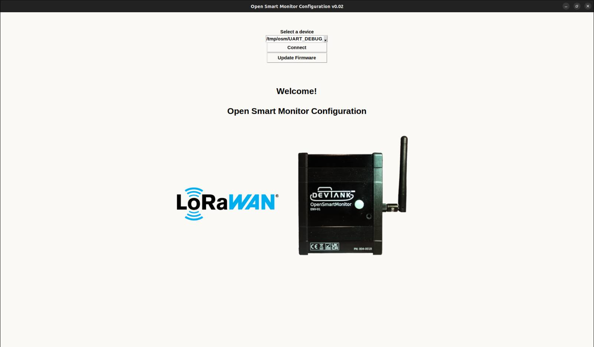

-   Press update firmware.

-   Select complete.bin which is the default image we provide for the
    sensor.

-   Once you press open, you will be asked for confirmation on whether
    to write the image to the sensor.

-   It will take a few seconds to download.

Connect
-------

-   Opening the GUI will bring you to the connect page.

-   Select the correct USB port that your sensor is connected to and
    press connect, the application will then start communicating to the
    sensor and retrieving its configuration and populating the gui.

-   You will then be transferred to the home page which displays current
    measurements and LoRaWAN configuration.

 
Current Measurements
====================

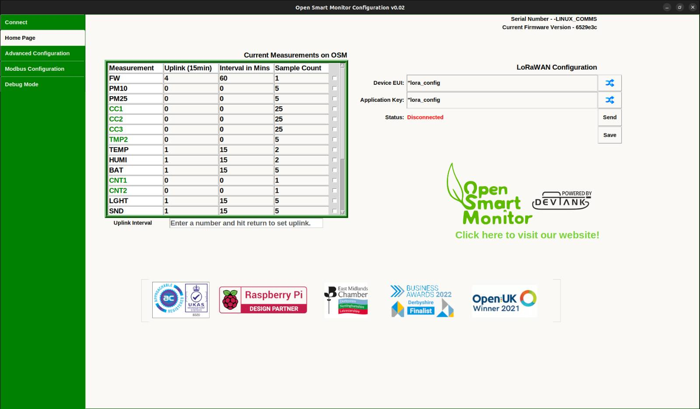

This window reads all of the measurements available on your OSM Device
and allows you to set the data transmission intervals. This can be done
by changing the number in the Uplink heading (default is multiples of
15mins) or if you prefer, you can change the number of minutes per
interval under Interval in Mins. You can also set the number of samples
that are taken within each interval under the Sample Count heading.

-   To make a change, you must select a cell and enter a number. Once
    you click somewhere else on the page, the command will be sent to
    the OSM Device.

-   To change the uplink, enter a number into the entry bar and press
    enter. This will affect how often the sensor sends a report.

-   To turn off multiple measurements, select the checkbox on the row
    of the measurement, this will bring up the button “Set interval to 0”
    and will apply to all the measurements you check.

-   If you want to see the last value of a measurement,select all the
    checkboxes of the measurements that you want to see, then press "Get Value".

LoRaWan Configuration
---------------------

-   The current dev-eui and app-key on the sensor will populate the
    entry boxes when you first load the gui.

-   Manually enter a device eui or an application key or randomly
    generate one by pressing the buttons.

-   To write them to the OSM Sensor press ‘Send’.

Advanced Configuration
======================

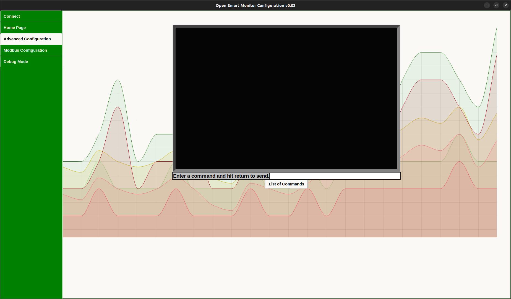

-   If you want to communicate with the sensor without the help of the
    GUI and see its raw output, you can send commands to it using the
    entry bar.

-   If you type '?' you will see a list of commands that you can use.

-   Some basic commands you can use include 'get_meas' followed by the
    name of the measurement e.g. 'get_meas TEMP'.

-   Typing 'comms_conn' will tell you if your sensor is connected to
    LoRaWAN or any other external communication type.

-   Typing 'measurements' will output all of the measurements and their
    intervals and samplecount.

-   Typing 'mb_log' will output the Modbus configuration of the OSM.

 
 
 
 
 S
 
 

Modbus Configuration
====================

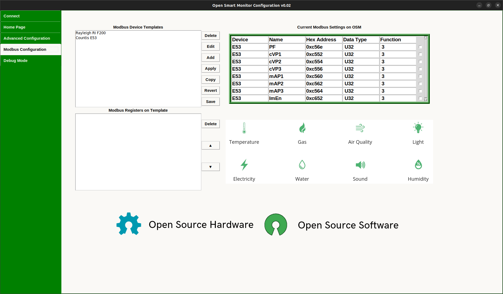

-   Opening the modbus configuration tab brings you to a window with
    templates that contain a modbus device and registers associated to
    that device.

-   The Countis E53 and Rayleigh RI F 2000 Modbus are devices that
    Devtank support and are saved as defaults with the application.

-   To write the device and registers from a template to the OSM sensor
    you need to highlight a template and press ‘Apply’.

-   To delete a template, select one from Modbus Device Templates and
    press the delete button at the top of the window.

-   You can edit an existing template or copy one if you want to retain
    the original template.

-   You can add a new template by pressing ‘Add’ which will open a new
    window where you can submit information on the device and add
    registers. You will need a datasheet for the modbus device that you
    want to add to ensure you are inputting the correct information.

-   By pressing ‘Revert’ you will undo any changes you have made since
    opening the Modbus Configuration page.

-   ‘Save’ will submit all changes such as the addition, removal and
    editing of templates or registers. Any templates created or changes
    made prior to pressing this ‘Save’ button on the Modbus
    Configuration page will be lost when the window is exited.

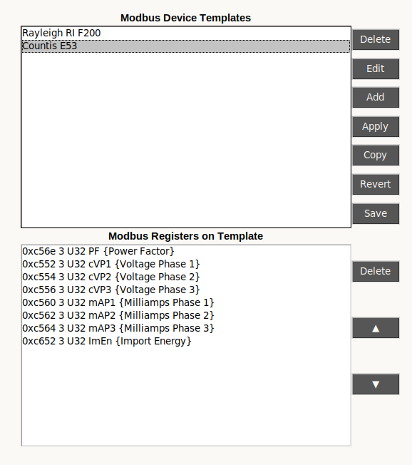

-   Highlighting a template will load its registers underneath.

-   To delete a register, highlight the register before pressing
    ‘Delete’ .

-   To rearrange the order of the registers, highlight one and shift it
    up or down using the arrows.

-   Remember to save your changes afterwards or they will be lost.

-   This is the window that pops up when you edit, copy or add a
    template. An edited template will replace the template you have
    selected, a copied template will be a seperate template and a new
    template will open this window with a few default values.

-   All of the fields must be filled in with the correct requirements in
    order for the template to be added.

-   The fields Template Name and Description are associated with the
    template. All of the other fields at the top are associated with the
    Modbus Device.

-   The delete, up, down and add buttons are associated with the
    registers on this window.

-   Pressing add opens the following window below.

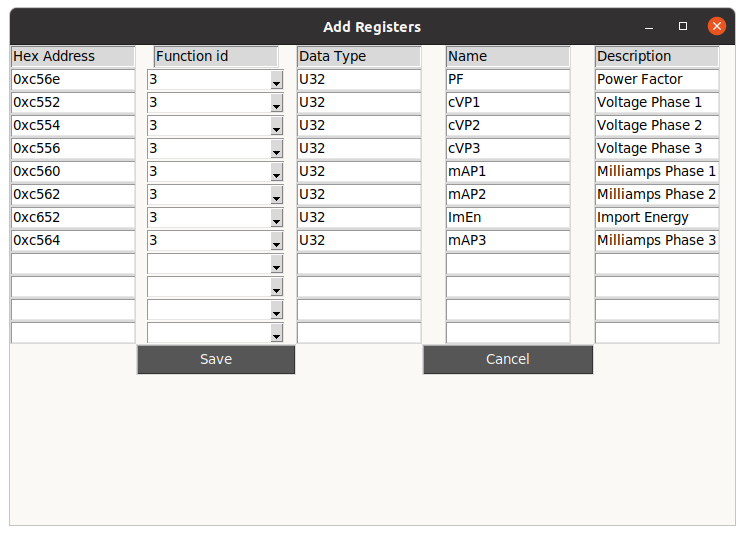

-   Fill in the associated fields and press save to add the registers to
    the template you are editing/creating.

-   Pressing save on the Add Registers page or the Add New Template page
    will NOT save to the database, it will save to a temporary file.
    Only the save button on the Modbus Configuration Page will save to
    the database.

Set IOs
=======

-   In current measurements: select TMP2, CNT1 or CNT2 to bring up a
    dialogue for enabling or disabling the IO pin.

-   This must be activated before these special measurements can start
    reporting data.

    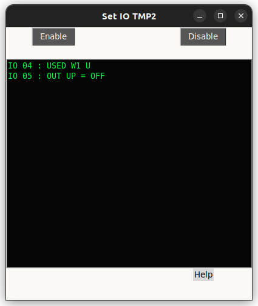

-   This is the window that will open for TMP2, select rise, fall or both
    depending on which edge of the pulse you are watching for and then
    press enable.

    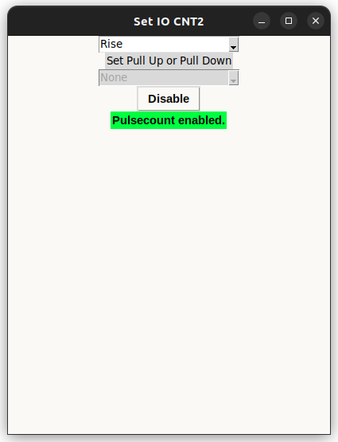

-   Selecting CNT2 provides you with an extra option, to set the pullup
    for the IO.

-   None of the options will make a dramatic effect.

 
 
 
 
 
 
 
 
 
 
 
 
 
 
 
 
 

Scaling Current
===============

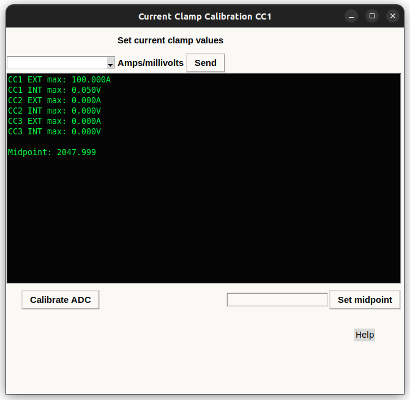

-   Selecting CC1, CC2 or CC3 will bring up this window where you can
    calibrate your current clamp measurements.

-   Set the exterior cc value by entering a number in the Amps entry,
    set the interior cc value by entering a number in the Millivolts
    entry. Press send when you have filled both values.

-   Set the midpoint by either pressing the button Calibrate ADC or
    manually set it by entering it manually in the entry box and
    pressing Set Midpoint.

 
 
 
 

4-20 Milliamps
==========

    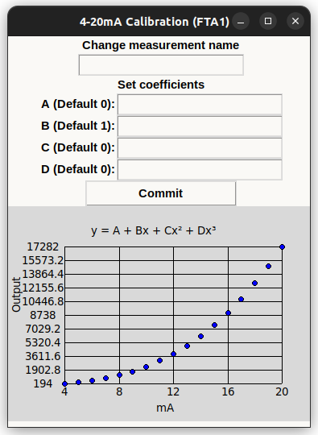

-   Selecting one of the special measurements named 'FTA[1,2,3,4]' will
    open this window.

-   Set the coefficients to whichever integers your use case requires and
    press commit to save the changes. This will close the window, open it
    again if you want to see the changes to the output from the equation.

-   You can also change the name of the measurement to something which
    may make more sense to you, the name can't exceed 4 characters.

 
 
 
 
 
 
 
 
 
 

Saving / Loading Configuration Files
==========

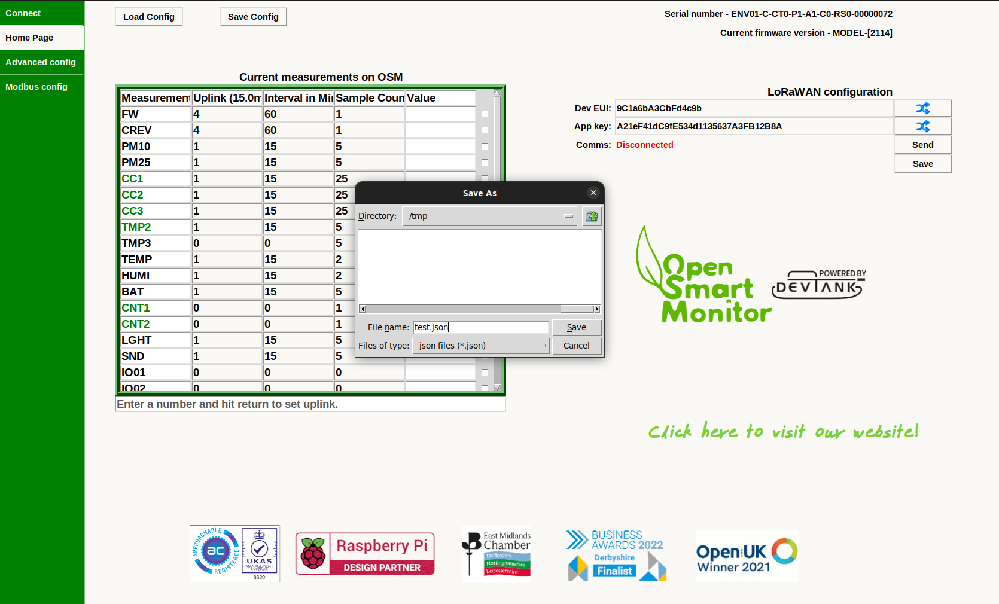

-   Saving the current settings of your OSM can save you a lot of time and
    pain if you were to lose the configuration on your OSM.

-   To do this, select 'Save Config' at the top of the home page, give the file
    a name and make sure it is a json filetype, as shown in the image above,
    because when loading a configuration file, the file dialog will only look for
    json files.

-   To write a configuration file to your OSM, select 'Load Config' and select
    the config file you want to load, the GUI will verify that is a valid config
    before writing it to your OSM and reloading the GUI.
