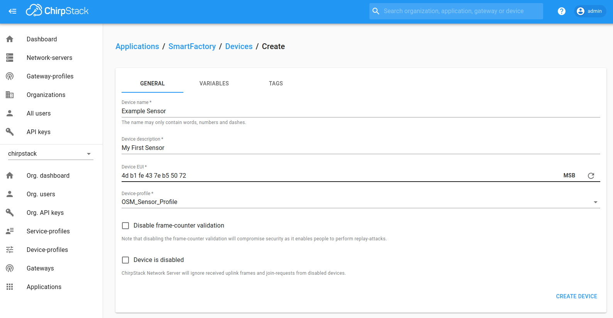
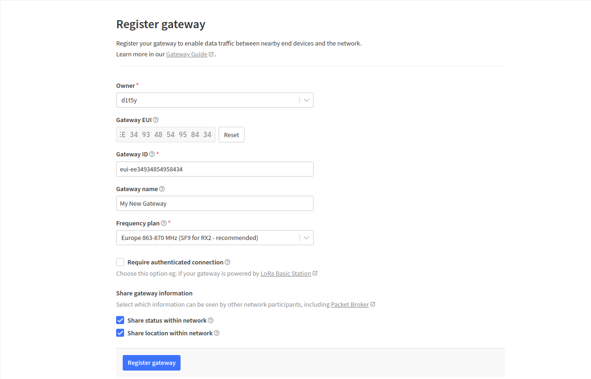
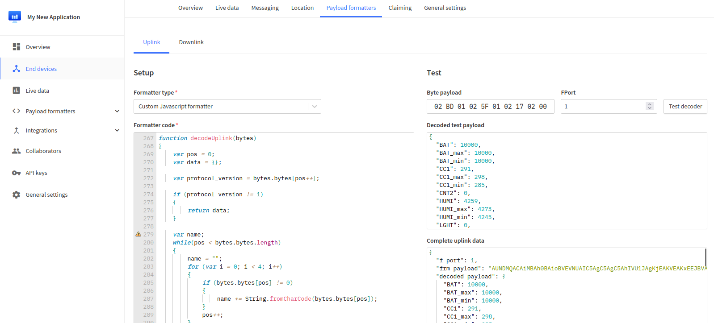
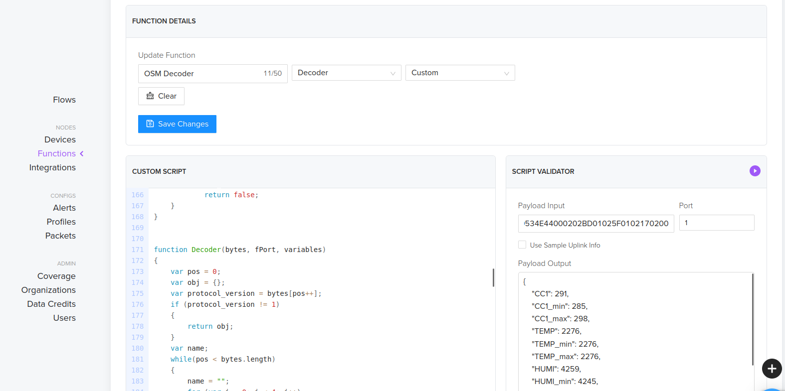
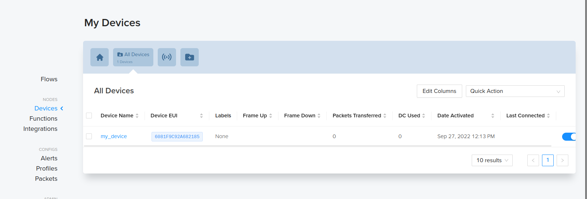
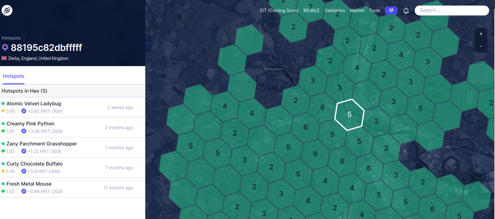

= Connecting OpenSmartMonitor over LoRaWAN

The following guide will take you through the steps required in order to get your
OSM connected to three of the major platforms which support LoRaWAN and start sending
and receiving data!

== ChirpStack

To gain access to the ChirpStack console, you will need to install it on your machine.
Instructions on how to do this can be found at https://www.chirpstack.io/docs/

=== Device Profile

. Access the ChirpStack console.
. You should have set up the service profile, organisation, network server and gateway as described by ChirpStack's documentation.
. Create a device profile for the OSM sensor, by navigating to 'Device-profiles', click 'Create'.
. Name the device profile something relevent, such as 'OSM_Device_Profile' and select the network server the OSM shall connect through.
. The OSM Rev C is compatible with the 1.0.2 LoRaWAN MAC version Revision A.
. Use the default ADR algorthim for best connection results.
. The 'Max EIRP' can be set to 0 and the uplink should be set to 900 seconds.
. The device supports OTAA and complies to only class A and, class C LoRaWAN device specifications.
. Under the 'Codec' section, select 'Custom Javascript codec functions' and paste in the encode and decode functions supplied by Devtank Ltd.
. Press 'Create Device-profile' to save your device-profile.

=== Add devices

. Under 'Applications', select 'Create' and provide a name, description and provide a service profile.
. Within the application you can add integrations such as MQTT or InfluxDB.
. To add a device, select 'Create' inside your application.
+

. Name your sensor (recommended: serial number of OSM).
. Give some description to the sensor (recommended: location of OSM once installed).
. A default 'Dev EUI' and 'App Key' should be provided with the sensor, if a new one is to be used you can generate it here, but ensure they match the ones set with the OSM Configuration GUI.
. Select the newly created device profile and keep 'Disable frame-counter validation' and 'Device is disabled' unchecked.

== The Things Network

=== Set up

. Access The Things Stack console at https://console.cloud.thethings.network
. Select a cluster depending on your location e.g. Europe 1.
. You will need to register your gateway, select 'Go to gatways'.
. Select 'Register Gateway'.
+
image::Images/register_gateway.png[]
. Provide an owner and a Gateway EUI.
. Provide a gateway name and select a frequency plan.
+

. Check the documentation of your gateway provider for any additional configuration you may need to connect your gateway.

=== Add devices
. Select the 'Applications' header followed by 'Add application'.
. Provide an owner, application ID, application name and description.
+
image::Images/add_application.png[]
. Your application should have been created. Inside it, select 'Add end device'.
. To add the device's configuration, select the heading 'Manually'.
. Provide a frequency plan, select LoRaWAN version 1.0.0.
. Generate or enter the DevEUI and AppEUI of the sensor. Note this down.
. The AppEUI should be the same as the DevEUI.
. Generate or enter the AppKey of the device. Note this down.
. Select 'Register end device' to finalise.
+
image::Images/end_device.png[]
. You should see activity on the overview page if the gateway and device are alive.
+
image::Images/overview.png[]
. To submit a protocol to decode messages from your device, head to 'Payload Formatters' on the left panel and select 'Uplink'.
. Select Customer JavaScript formatter under 'Formatter Type'.
. To apply this protocol to each device, go to 'End Devices' - 'Payload Formatters' - 'Uplink' - 'Formatter type' (Custom Javascript formatter) - 'Paste Application formatter' - 'Save changes'.
+

== Helium

=== Set up

. Open up the helium console at https://console.helium.com.
. Sign up. You will be asked to verify your email address, the link from this email will redirect you to the console.
. Create an organisation when prompted to.
. To add a custom JavaScript protocol, navigate to 'Functions' under 'Nodes' and enter the custom script.
+

=== Add devices

. To add a device - select 'Devices' under 'Nodes' and choose 'Add New Device'.
+

. Give the device a name, Dev EUI, App Key and fill the App EUI with zeros.
. Press 'Save Device'.
. In order for the device to connect, the sensor must be within range of Heliums Hotsport coverage.
. Explore hotspots at https://explorer.helium.com/.
+

