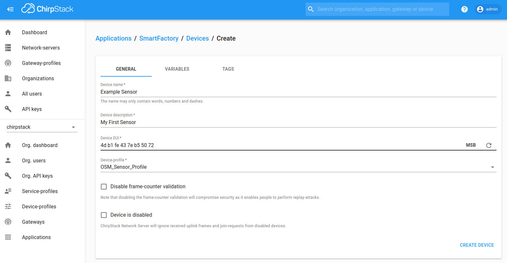
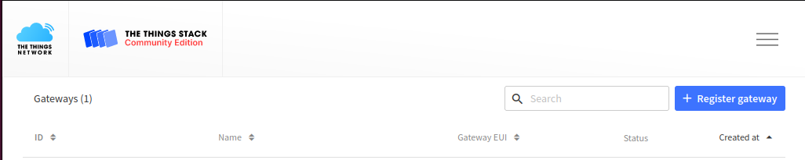
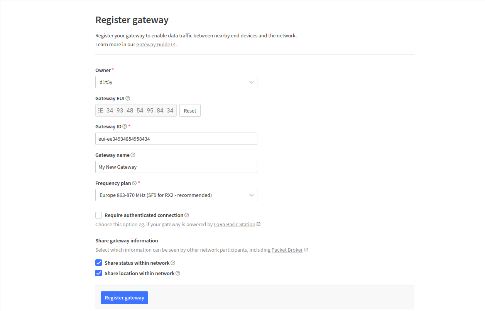
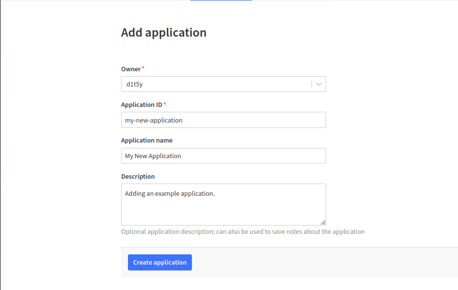
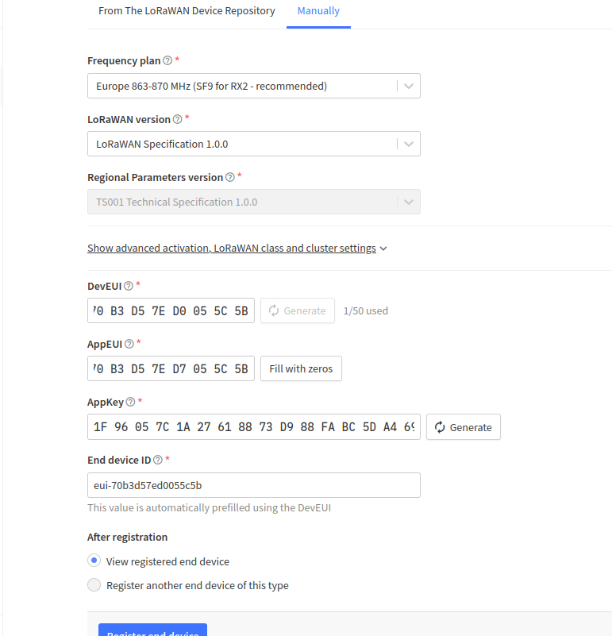
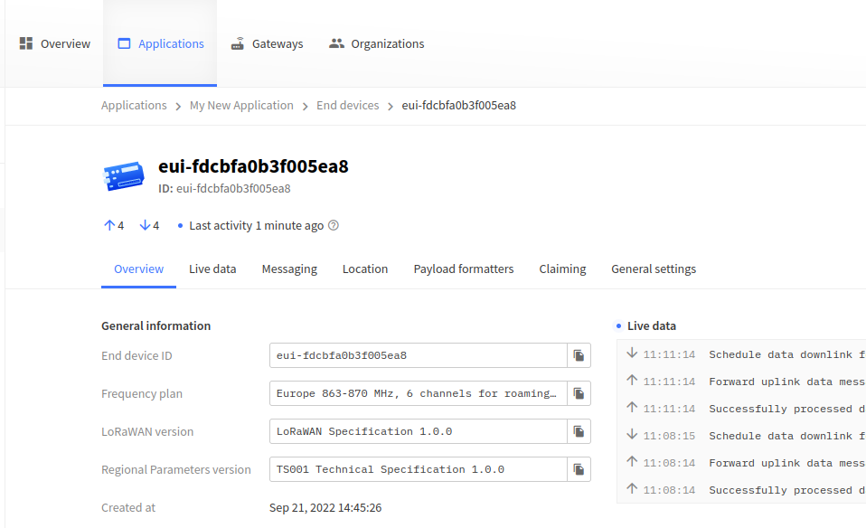
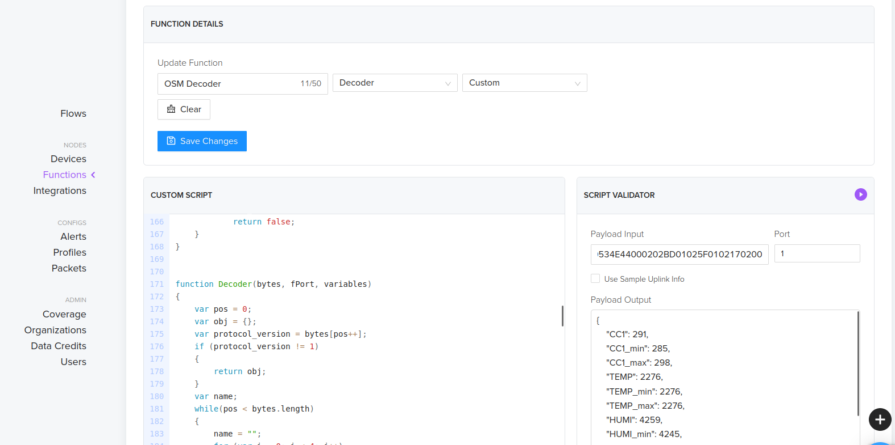
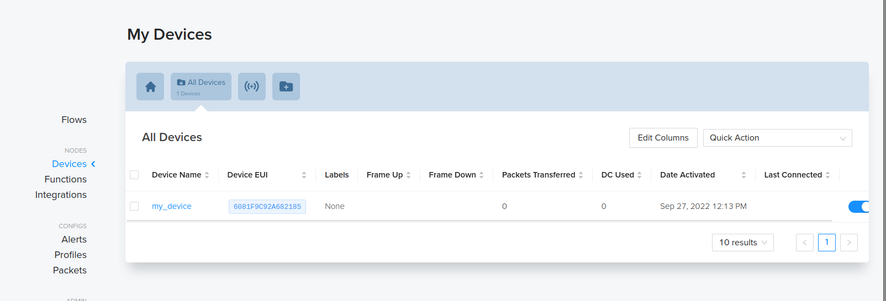
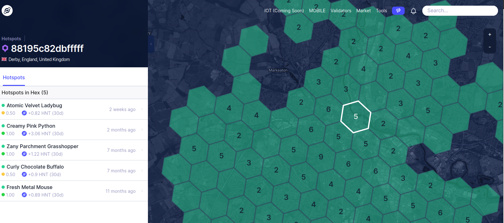

The following guide will take you through the steps required in order to
get your OSM connected to three of the major platforms which support
LoRaWAN and start sending and receiving data!

ChirpStack
==========

To gain access to the ChirpStack console, you will need to install it on
your machine. Instructions on how to do this can be found at
<https://www.chirpstack.io/docs/>

Device Profile
--------------

1.  Access the ChirpStack console.

2.  You should have set up the service profile, organisation, network
    server and gateway as described by ChirpStack’s documentation.

3.  Create a device profile for the OSM sensor, by navigating to
    *Device-profiles*, click *Create*.

4.  Name the device profile something relevent, such as
    *OSM\_Device\_Profile* and select the network server the OSM shall
    connect through.

5.  The OSM Rev C is compatible with the 1.0.2 LoRaWAN MAC version
    Revision A.

6.  Use the default ADR algorthim for best connection results.

7.  The *Max EIRP* can be set to 0 and the uplink should be set to 900
    seconds.

8.  The device supports OTAA and complies to only class A and, class C
    LoRaWAN device specifications.

9.  Under the *Codec* section, select *Custom Javascript codec
    functions* and paste in the encode and decode functions supplied by
    Devtank Ltd.

10. Press *Create Device-profile* to save your device-profile.

Add devices
-----------

1.  Under *Applications*, select *Create* and provide a name,
    description and provide a service profile.

2.  Within the application you can add integrations such as MQTT or
    InfluxDB.

3.  To add a device, select *Create* inside your application.

    

4.  Name your sensor (recommended: serial number of OSM).

5.  Give some description to the sensor (recommended: location of OSM
    once installed).

6.  A default *Dev EUI* and *App Key* should be provided with the
    sensor, if a new one is to be used you can generate it here, but
    ensure they match the ones set with the OSM Configuration GUI.

7.  Select the newly created device profile and keep *Disable
    frame-counter validation* and *Device is disabled* unchecked.

The Things Network
==================

Set up
------

1.  Access The Things Stack console at
    <https://console.cloud.thethings.network>

2.  Select a cluster depending on your location e.g. Europe 1.

3.  You will need to register your gateway, select *Go to gatways*.

4.  Select *Register Gateway*.

    

5.  Provide an owner and a Gateway EUI.

6.  Provide a gateway name and select a frequency plan.

    

7.  Check the documentation of your gateway provider for any additional
    configuration you may need to connect your gateway.

Add devices
-----------

1.  Select the *Applications* header followed by *Add application*.

2.  Provide an owner, application ID, application name and description.

    

3.  Your application should have been created. Inside it, select *Add
    end device*.

4.  To add the device’s configuration, select the heading *Manually*.

5.  Provide a frequency plan, select LoRaWAN version 1.0.0.

6.  Generate or enter the DevEUI and AppEUI of the sensor. Note this
    down.

7.  The AppEUI should be the same as the DevEUI.

8.  Generate or enter the AppKey of the device. Note this down.

9.  Select *Register end device* to finalise.

    

10. You should see activity on the overview page if the gateway and
    device are alive.

    

11. To submit a protocol to decode messages from your device, head to
    *Payload Formatters* on the left panel and select *Uplink*.

12. Select Customer JavaScript formatter under *Formatter Type*.

13. To apply this protocol to each device, go to *End Devices* -
    *Payload Formatters* - *Uplink* - *Formatter type* (Custom
    Javascript formatter) - *Paste Application formatter* - *Save
    changes*.

    

Helium
======

Set up
------

1.  Open up the helium console at <https://console.helium.com>.

2.  Sign up. You will be asked to verify your email address, the link
    from this email will redirect you to the console.

3.  Create an organisation when prompted to.

4.  To add a custom JavaScript protocol, navigate to *Functions* under
    *Nodes* and enter the custom script.

    

Add devices
-----------

1.  To add a device - select *Devices* under *Nodes* and choose *Add New
    Device*.

    

2.  Give the device a name, Dev EUI, App Key and fill the App EUI with
    zeros.

3.  Press *Save Device*.

4.  In order for the device to connect, the sensor must be within range
    of Heliums Hotsport coverage.

5.  Explore hotspots at <https://explorer.helium.com/>.

    
